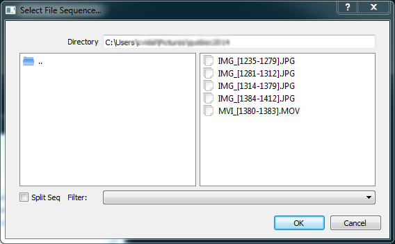
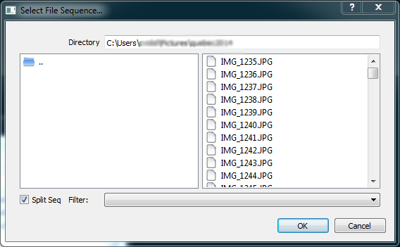
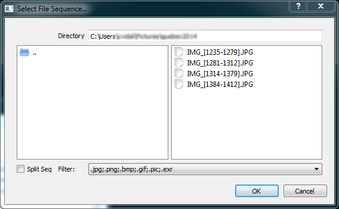
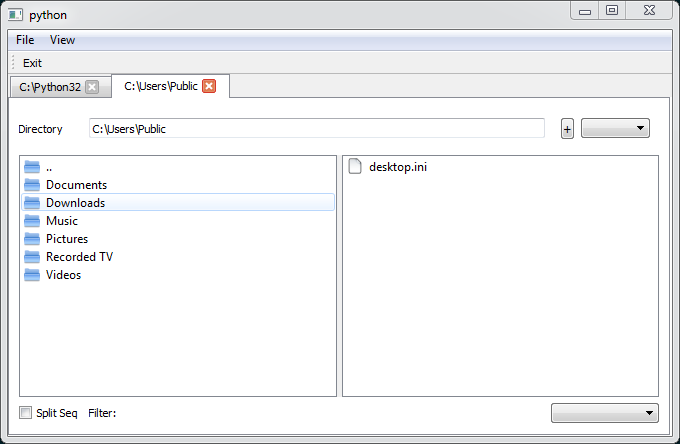

# FileSequenceWidget
A File Manager Widget in PySide managing the sequence file ( FILE0001.jpg FILE 0002.jpg -> FILE[0001-0002].jpg )

Feature:

Add the feature , rename single , or sequence file.